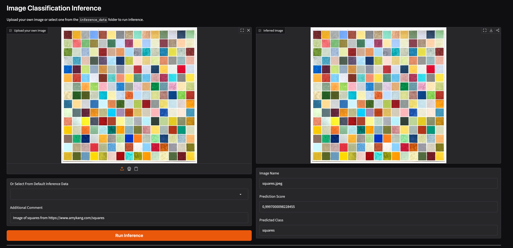
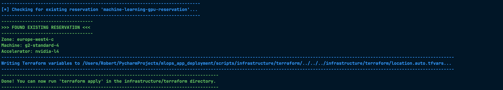
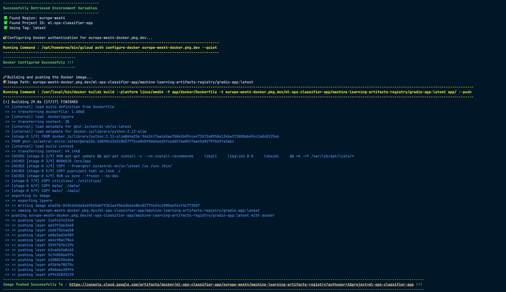
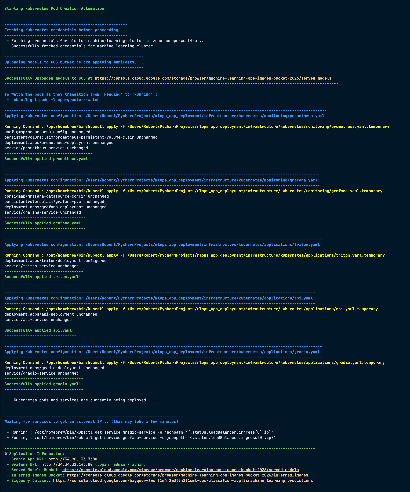
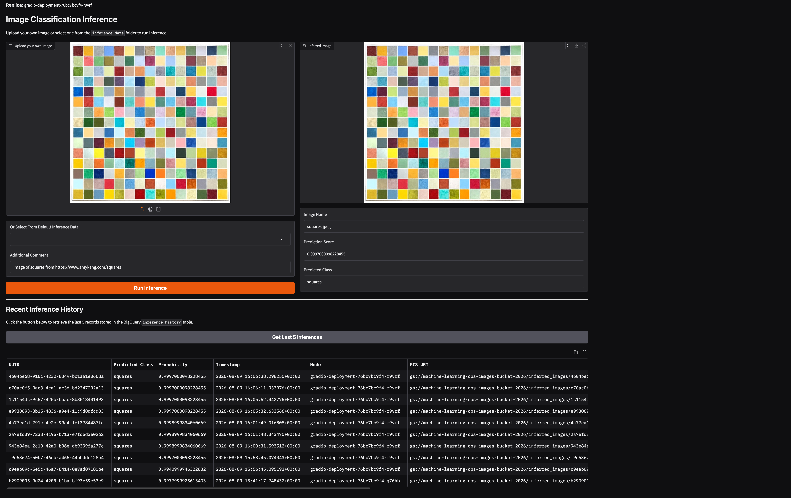

# MLOps Application Deployment Pipeline

This repository contains a full MLOps deployment pipeline featuring a **Gradio Frontend** and a **Triton Inference Server Backend**, running on **Google Kubernetes Engine (GKE)**, with infrastructure managed by **Terraform** on Google Cloud Platform (GCP). It integrates Google Cloud Storage (GCS) for model storage, BigQuery for prediction history logging, and Artifact Registry for custom Docker images.
<div align="center">
  
</div>

---

## Table of Contents
1. [Prerequisites](#1-prerequisites)
2. [Architecture Overview](#2-architecture-overview)
3. [Repository Structure](#3-repository-structure)
4. [Deployment Steps](#4-deployment-steps)
5. [Useful Commands](#5-useful-commands)
   - [Google Cloud SDK (gcloud)](#google-cloud-sdk-gcloud)
   - [Terraform (terraform)](#terraform-terraform)
   - [Docker (docker)](#docker-docker)
   - [Kubernetes (kubectl)](#kubernetes-kubectl)
6. [Application Features](#6-application-features)

---

## 1. Prerequisites

To run this repository locally or to prepare for deployment, you will need to ensure the following prerequisites and dependencies are configured:

### Package Management
- **`uv`**: Used for Python package management.

### Google Cloud Platform (GCP)
- **Artifact Registry**: To store our Gradio application Docker image.
- **Infrastructure Bucket**: A GCS bucket to store our Terraform state file securely.
- **Application Bucket**: A GCS bucket to store the images that are uploaded by the user.
- **BigQuery**: To store and retrieve the inference history.

### Infrastructure
- **Terraform**: For provisioning and managing our infrastructure.
- **Kubernetes**: For container orchestration and deploying workloads.

### Monitoring
- **Grafana**: For dashboard visualization.
- **Prometheus**: For metrics collection and monitoring.

---

## 2. Architecture Overview

This project implements an MLOps architecture on GCP:

- **Frontend (Gradio)**: A web interface running on a standard compute CPU node pool (`gradio-machine-learning-node-pool`).
- **Backend (Triton Inference Server)**: A model serving engine running on a dedicated GPU node pool (`triton-machine-learning-node-pool` with NVIDIA T4 GPUs). It pulls machine learning models dynamically from a GCS bucket.
- **Data Flow**: Users upload data via Gradio. Gradio communicates with Triton via internal Kubernetes DNS (`triton-service:8001`) over GRPC to request inference. Results are returned to the user, and inference metadata can be logged to BigQuery.
- **Infrastructure**: Terraform is used to provision VPCs, Kubernetes clusters, node pools, Artifact Registries, and GCS buckets.

---

## 3. Repository Structure

The repository is organized into three primary areas to enforce a clear separation of concerns:

- **`app/`**: Contains all application-level code. This includes the Gradio frontend interface, data handling logic, helper utilities for interacting with Google Cloud APIs, and the Docker configurations required to containerize the application.
- **`infrastructure/`**: Contains all infrastructure-as-code (IaC) definitions. This is divided into Terraform scripts for provisioning the underlying GCP resources, and Kubernetes manifests for orchestrating the containers on GKE.
- **`scripts/`**: Contains utility scripts for local debugging, manual testing, or maintenance tasks.

```text
.
├── app/
│   ├── data/                 # Datasets and local inference files
│   ├── docker/               # Dockerfiles (e.g., for building the Gradio app)
│   ├── main/                 # Gradio frontend application logic
│   └── utilities/            # Helper modules (Google Cloud, OS functions, etc.)
├── infrastructure/
│   ├── kubernetes/           # Kubernetes manifests (Gradio, Triton, NVIDIA DaemonSets)
│   └── terraform/            # Terraform configurations (Main, Variables, Outputs)
└── scripts/                  # Utility and debugging scripts
```

---

## 4. Deployment Steps

Due to cloud capacity limits, acquiring a GPU as an individual requires finding an available zone. The deployment workflow handles this automatically using Python scripts located in the `scripts/infrastructure` directory, rather than relying on manual commands.

**1. Provision Infrastructure & Define Zone**
Run the setup script to iterate through multiple GCP zones, locate an available NVIDIA GPU, and reserve it. This script automatically creates a file that sets the regions and zones for us.
```bash
uv run python scripts/infrastructure/terraform/setup_infrastructure_location.py
```

*Manual Equivalent*:
If you were to search and reserve manually, you would execute a command like:
```bash
gcloud compute reservations create machine-learning-gpu-reservation --project=<PROJECT_ID> --machine-type=<MACHINE_TYPE> --accelerator=type=<GPU_TYPE>,count=1 --zone=<ZONE> --vm-count=1 --require-specific-reservation
```

Once the zone is reserved and the variables file is generated, provision the infrastructure (networking, GKE cluster, node pools) via Terraform:
```bash
cd infrastructure/terraform
terraform init
terraform apply -auto-approve
```

Below the output of `setup_infrastructure_location.py`:
<div align="center">
  
</div>

**2. Build and Push the Gradio Image**
Once the infrastructure (including the Artifact Registry) is ready, we must authenticate Docker with Google Cloud using `gcloud auth configure-docker`. The deployment script handles this authentication automatically before building the Gradio application Docker image and pushing it to the registry.
```bash
uv run python scripts/infrastructure/docker/build_and_push.py
```

*Manual Equivalent*:
To authenticate manually and push the image for the standard GKE linux/amd64 architecture, you would run:
```bash
gcloud auth configure-docker <REGION>-docker.pkg.dev
/usr/local/bin/docker buildx build --platform linux/amd64 -f app/docker/Dockerfile -t <REGION>-docker.pkg.dev/ml-ops-classifier-app/machine-learning-artifacts-registry/gradio-app:latest app/ --push
```
*(Note: Replace `<REGION>` with the region corresponding to the zone selected in step 1, e.g., `europe-west4`)*

Below the output of `build_and_push.py`:
<div align="center">
  
</div>

**3. Deploy Pods and Containers**
Finally, the deployment script automates several steps sequentially to bring the application online:
1. Fetches the Kubernetes cluster credentials.
2. Uploads the local ML models to the GCS bucket so Triton can serve them.
3. Injects the region into the Kubernetes YAML manifests.
4. Applies the monitoring (Prometheus, Grafana) and application (Triton, API, Gradio) manifests.
5. Waits for the LoadBalancers to spin up and extracts their public IPs.
```bash
uv run python scripts/infrastructure/kubernetes/create_kubernetes_pods.py
```

*Manual Equivalent*:
To deploy manually, you would need to run the following sequence:
```bash
# Fetch cluster credentials
gcloud container clusters get-credentials machine-learning-cluster --zone <ZONE> --project ml-ops-classifier-app

# Upload Models to GCS
gcloud storage cp -r infrastructure/docker/triton/served_models/* gs://machine-learning-ops-images-bucket-2026/served_models/

# Apply Manifests (assuming REGION_PLACEHOLDER is manually replaced in the YAML files)
kubectl apply -f infrastructure/kubernetes/monitoring/prometheus.yaml
kubectl apply -f infrastructure/kubernetes/monitoring/grafana.yaml
kubectl apply -f infrastructure/kubernetes/applications/triton.yaml
kubectl apply -f infrastructure/kubernetes/applications/api.yaml
kubectl apply -f infrastructure/kubernetes/applications/gradio.yaml

# Get External IPs
kubectl get service gradio-service --watch
kubectl get service grafana-service --watch
```

After successful deployment, the script outputs a clean summary of URLs, including your live Gradio App IP, Grafana dashboard, BigQuery Dataset, and GCS buckets.

Below the output of `create_kubernetes_pods.py`:
<div align="center">
  
</div>

---

## 5. Useful Commands

### Google Cloud SDK (gcloud)

#### Prerequisites & Authentication
Before starting, you must authenticate your local machine with Google Cloud.

**1. Revoke existing credentials (optional, for a clean slate):**
```bash
gcloud auth revoke --all
gcloud config unset project
```

**2. Login to Google Cloud:**
```bash
gcloud auth login
```

**3. Set Application Default Credentials (used by Terraform):**
```bash
gcloud auth application-default login
```

#### Docker Authentication
Configure Docker to authenticate with GCP's Artifact Registry, allowing you to push and pull images securely:
```bash
gcloud auth configure-docker <REGION>-docker.pkg.dev
```

#### Uploading Models to GCS
Triton expects your ML models to be available in a Google Cloud Storage bucket so it can serve them efficiently on the backend. Since the provided models are stored locally within the `docker/triton/served_models` directory, you need to upload them to the GCS bucket created by Terraform.
```bash
gcloud storage cp -r docker/triton/served_models/ gs://machine-learning-ops-images-bucket-2026/
```

#### Kubernetes Cluster Access
Install the GKE Auth Plugin and fetch the cluster credentials so your local `kubectl` tool can communicate directly with your newly created Kubernetes API server:
```bash
gcloud components install gke-gcloud-auth-plugin
gcloud container clusters get-credentials machine-learning-cluster --zone <ZONE> --project ml-ops-classifier-app
```

#### Troubleshooting Stuck Node Provisioning
If Terraform hangs while creating node pools, you can use `gcloud` to troubleshoot:

**1. Check cluster status:**
```bash
gcloud container clusters list --project=ml-ops-classifier-app
```
*(If the status is `RECONCILING`, GKE is currently locked updating a node pool).*

**2. View existing node pools:**
```bash
gcloud container node-pools list --cluster machine-learning-cluster --location <ZONE>
```

**3. Read the error message:**
```bash
gcloud container node-pools describe triton-machine-learning-node-pool --cluster machine-learning-cluster --location <ZONE>
```

**4. Delete the stuck node pool manually to unblock Terraform:**
```bash
gcloud container node-pools delete triton-machine-learning-node-pool --cluster machine-learning-cluster --zone <ZONE> --quiet
```

---

### Terraform (terraform)

We use Terraform to automatically spin up the VPC, Kubernetes Cluster, Node Pools, Artifact Registry, Storage Buckets, and BigQuery datasets.

**1. Install Terraform (Mac/Ubuntu):**
```bash
# Mac using Homebrew
brew tap hashicorp/tap
brew install hashicorp/tap/terraform

# Ubuntu using Snap
sudo snap install terraform --classic
```

**2. Deploy the Infrastructure:**
```bash
# Initialize Terraform providers (downloads the required plugins to communicate with GCP)
terraform init

# Review the planned changes (shows a dry-run of what infrastructure will be created/destroyed)
terraform plan

# Apply the changes to Google Cloud (provisions the actual cloud infrastructure based on the plan)
terraform apply -auto-approve
```
*(Tip: `terraform fmt` can be used to automatically format your configuration files).*

---

### Docker (docker)

We need to build our Gradio application into a Docker container and push it to the Google Artifact Registry created by Terraform.

**1. Setup Cross-Compiler (For ARM/Mac users):**
*Ensures the Docker image is built for the standard linux/amd64 architecture expected by GKE, regardless of your local machine.*
```bash
docker buildx create --name cross-compiler --use
docker buildx inspect --bootstrap
```

**2. Build and Push the Docker Image:**
*Builds the image from the local `app` directory and pushes it directly to the Artifact Registry in one step.*
```bash
/usr/local/bin/docker buildx build --platform linux/amd64 -f app/docker/Dockerfile -t <REGION>-docker.pkg.dev/ml-ops-classifier-app/machine-learning-artifacts-registry/gradio-app:latest app/ --push
```

**3. Run the Container Interactively (Debugging):**
*If you need to enter the container to test the internal structure or run a script manually without triggering the main application, you can override the default command with a bash shell:*
```bash
# First, build the image locally (e.g., tagging it as mlops-app)
docker build -t mlops-app -f app/docker/Dockerfile app/

# Run the container interactively to get a bash shell
docker run -it --rm mlops-app /bin/bash

# Alternatively, run a specific test script directly without the shell
docker run --rm mlops-app /src/app/.venv/bin/python app/utilities/inference_utilities.py
```

---

### Kubernetes (kubectl)

Once the infrastructure is up, images are pushed, and models are uploaded, we deploy the workloads to GKE.

**1. Verify node access:**
```bash
kubectl get nodes
```

**2. Install NVIDIA GPU Drivers (DaemonSet):**
*Deploys a DaemonSet (a pod on every eligible node) that automatically installs the proprietary NVIDIA GPU drivers onto your GKE nodes. This is mandatory for Triton to utilize the attached L4 GPUs.*
```bash
curl -o nvidia-daemonset.yaml https://raw.githubusercontent.com/GoogleCloudPlatform/container-engine-accelerators/master/nvidia-driver-installer/cos/daemonset-preloaded-latest.yaml
kubectl apply -f nvidia-daemonset.yaml
```

**3. Deploy Applications:**
*Applies the Kubernetes manifests to create the Deployments (Pods) and Services (Networking).*
```bash
# Deploy Triton Backend and Gradio Frontend
kubectl apply -f kubernetes/applications/triton.yaml
kubectl apply -f kubernetes/applications/gradio.yaml

# Watch the Gradio pods as they transition from 'Pending' to 'Running'
kubectl get pods -l app=gradio --watch

# Wait for GCP to provision an external IP for the Gradio Service LoadBalancer
kubectl get service gradio-service --watch
```

**4. Access the Live Application:**
Once the LoadBalancer is fully provisioned, the Gradio frontend is available to the public. 
You can retrieve the public external IP address of your Gradio application by running:
```bash
kubectl get service gradio-service
```
Look for the `EXTERNAL-IP` column in the output. The application will be accessible at `http://<EXTERNAL-IP>:80`.

**5. Tear Down Applications:**
*To quickly stop and delete all running pods, deployments, and services in your default namespace without destroying the entire cluster:*
```bash
kubectl delete all --all
```


---


*Note: This infrastructure setup is highly autonomous. Terraform may destroy and recreate resources (like Node Pools) automatically to bypass cloud capacity limits.*


---

## 6. Application Features

Below is a detailed view of the live Gradio application with annotations highlighting its different features.

<div align="center">
  
</div>
